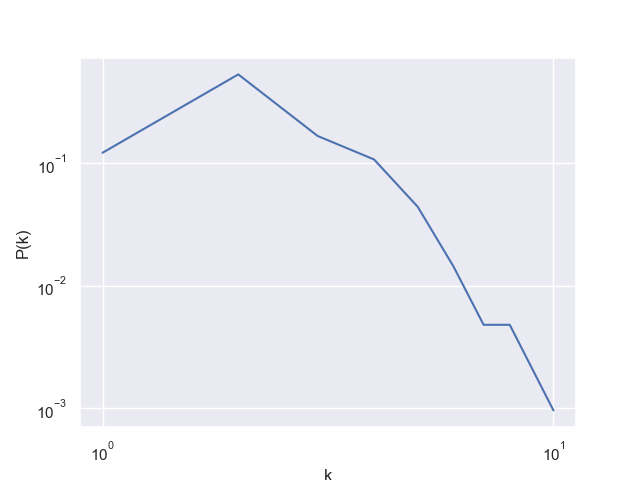

<h1 align="center">European road network analysis</h1>
<h3 align="center"> Computer science and engineering </h3>
<h5 align="center"> Project Assignment - Complessità nei sistemi e nelle reti  - <a href="https://www.polimi.it/">Politecnico di Milano</a> (March 2023) </h5>

 
  

<!-- TABLE OF CONTENTS -->
<h2 id="table-of-contents"> :book: Table of Contents</h2>

  
Table of Contents

  <ol>
    <li><a href="#about-the-project"> ➤ About The Project</a></li>
    <li><a href="#project-files-description"> ➤ Project Files Description</a></li>
    <li><a href="#graph-analysis"> ➤ Graph analysis</a></li>
    <li><a href="#references"> ➤ References</a></li>
  </ol>

<!-- ABOUT THE PROJECT -->
<h2 id="about-the-project"> :pencil: About The Project</h2>

 
 The focus of the project, is to analyze the European road network graph with the purpose of discovering interesting insights.

The graph represents the European road network :  
<ul>
<li>A node represents a city. </li>
<li>An edge represents a road directly connecting two cities.</li>
</ul>
There are 1174 nodes (cities), connected by 1417 edges (direct roads), The network is undirected and unweighted.
 
The raw dataset can be found <a href="http://konect.cc/networks/subelj_euroroad/">here</a>, check also the profile of the author <a href="https://github.com/lovre">here</a>.

<!-- PROJECT FILES DESCRIPTION -->
<h2 id="project-files-description"> :floppy_disk: Project Files Description</h2>
<ul>
<li><b>GephiParser.py:</b> a simple script to parse some data in Gephy format.</li>
<li><b>CoordsRetriever.py:</b> it automatically retrieves cities coords using OpenStreetMaps API.</li>
<li><b>Euroroad.py:</b> the main script.</li>
</ul>

<!-- Analysis -->
<h2 id="graph-analysis"> :small_orange_diamond: Graph analysis</h2>
<h5>Generic stats</h5>
Considering the average distance (≈18) and the degree
distribution we can state that the network is neither small word
nor scale-free, moreover the network has almost tree-like
structure and it’s very sparse.

<h5>Community analysis</h5>
The key point of the project is the community analysis, some algorithms are evaluated. The analysis revealed a strong community structure.

| | | |
|:-------------------------:|:-------------------------:|:-------------------------:|
|  Louvain method |   Peristence probabilities alfa=0.85| Peristence probabilities alfa=0.7|

  
\textcolor{red}{For further analysis check the EuroRoad.pdf file}

<!-- Analysis -->
<h2 id="references"> :small_orange_diamond: References</h2>
[1] Robust network community detection using balanced propagation, L. Šubelj et. Al, 2011 (<a href="https://arxiv.org/pdf/1106.5524.pdf">arxiv.org</a>)
 
[2] Profiling core-periphery network structure by random walkers, F. Della Rossa et al, 2013. (<a href="https://www.nature.com/articles/srep01467">nature.com</a>)
 
[3] Fast unfolding of communities in large networks, Blondel et al. 2008. (<a href="https://arxiv.org/abs/0803.0476">arxiv.org</a>)
 
[4] Finding and testing network communities by lumped Markov chains, C. Piccardi, 2011. (<a href="https://arxiv.org/abs/1106.0596">arxiv.org</a>)
 
[5] Maps of random walks on complex networks reveal community structure, M. Rosvall, C. T. Bergstrom,
2008. (<a href="https://arxiv.org/abs/0707.0609">arxiv.org</a>)
 
[6] Near linear time algorithm to detect community structures in large-scale networks, U. N. Raghavan
et al., 2007. (<a href="https://arxiv.org/abs/0709.2938">arxiv.org</a>)
 
[7] Towards real-time community detection in large networks, I. X. Y Leung et al., 2009. (<a href="https://arxiv.org/abs/0808.2633">arxiv.org</a>)
